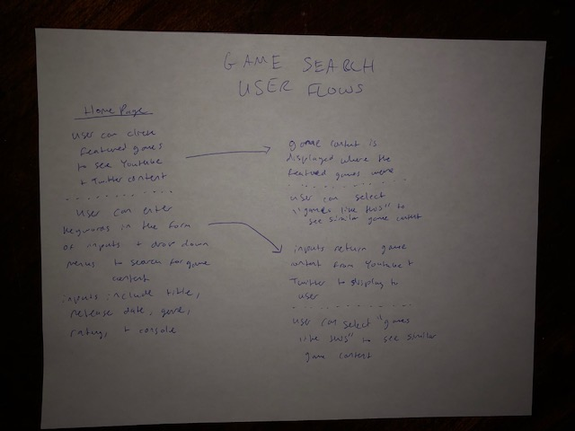
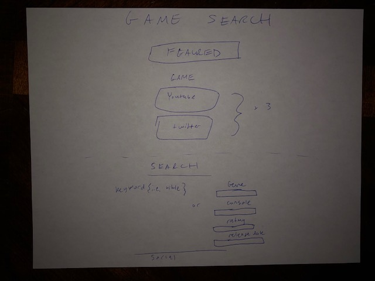
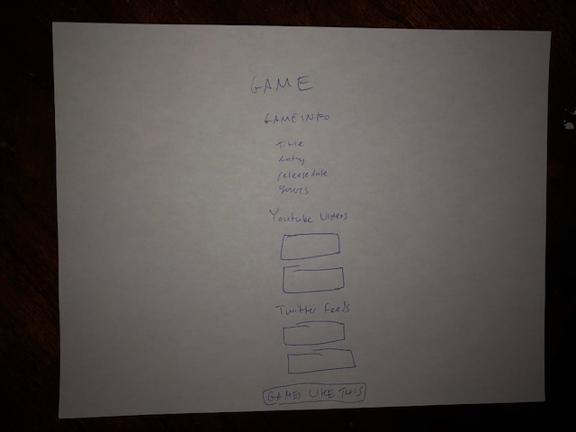

# game-search-app-api-capstone

## Summary
This application utilizes a RAWG API to request information from a database of games. The first part of the application features a random and recent game along with a screenshot and some details. The second part of the application allows the user to query the RAWG database, which pulls details on the queried game, utilizes the same API to suggest a similar game, and cross-references with the Youtube API to pull gameplay videos.

## Technologies used: 
* HTML
* CSS
* Javascript
* jQuery
* APIs

## User Stories

* As a new user, I want to be able to easily understand how to search for games. - HIGH Importance
* As a new user, I want to be able to search by a variety of keywords, including title, release date, and genres. - HIGH Importance
* As a new user, I want to be able to see video content around the games and keywords I've searched. - HIGH Importance
* As a new user, I want to be able to find similar content to what I've searched, that I've not seen before - MEDIUM Importance
* As a returning user, I want to be able to immediately see and have suggested content based on previous searches. - MEDIUM importance
* As a returning user, I want to be able to have preferences saved on keywords I've used. - LOW Importance
* As a returning user, I want to be able to see things that are trending. - LOW Importance
* As an administrator, I want to be able to see if certain results are coming up too frequently. - MEDIUM Importance
* As an administrator, I want to be able to have an understanding of trends in user searches. - LOW Importance
* As an administrator, I want to be able to be able to update the results of the searches. - LOW Importance

## Live Preview @ https://christian-m-george.github.io/game-search-app-api-capstone/

## Wireframes

## Image of the full page with search results

Built responsive to work with different screen sizes.